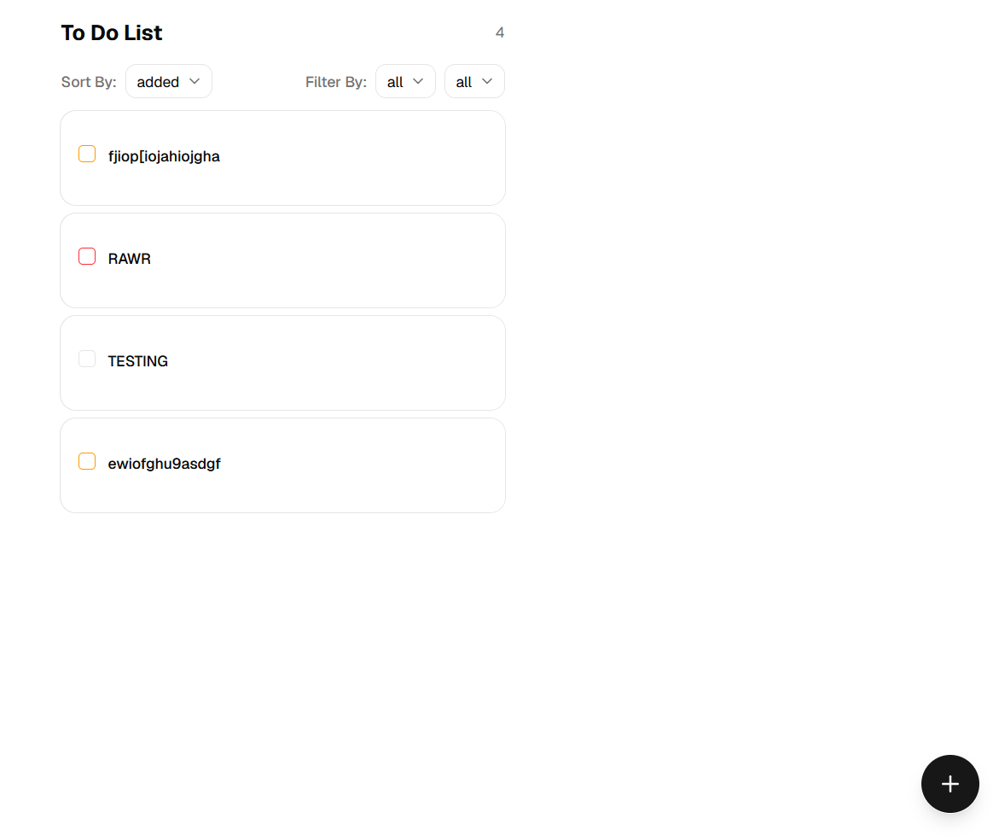
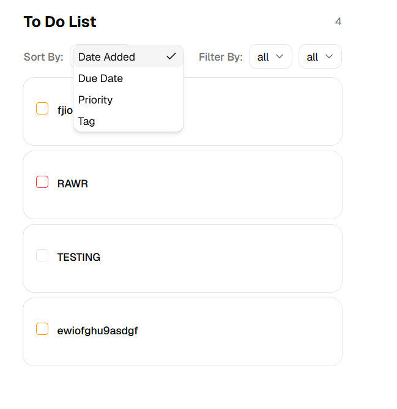
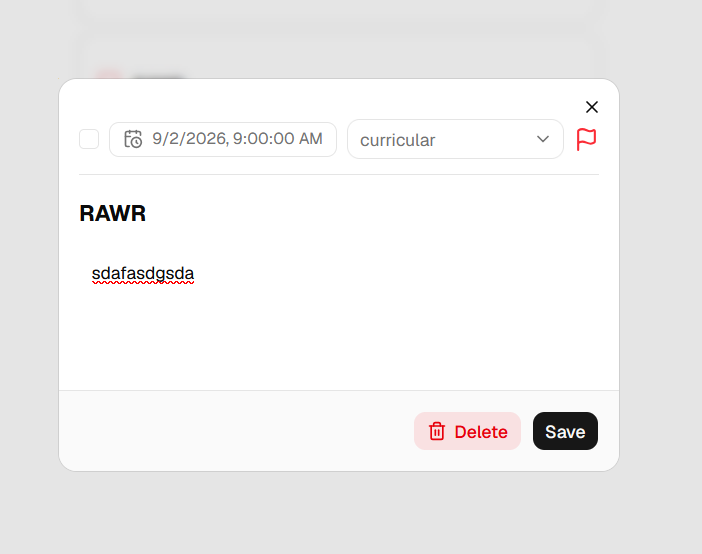

# To-Do List (MERN + TypeScript)

A full-stack to-do list app  tags

---

## Tech stack & why

**MERN + TypeScript**, split into a separate backend and frontend.

| Layer | Choice | Why |
| --- | --- | --- |
| Database | **MongoDB** (local, via Mongoose) | Documents map naturally to a task object; no rigid table setup. **Mongoose** adds a schema (validation) plus typed models, which pairs well with TypeScript. Runs locally so the app works offline with no cloud account. |
| Backend | **Express** | Minimal Setup and have already little experience |
| Language | **TypeScript** (both sides) | Catches shape mistakes at compile time before they become a problem. Run in dev with **tsx** (transpile + watch, no separate build step). |
| Frontend | **React** | My Most used frontend language and has many libraries and imports |
| UI | **Tailwind CSS** + **shadcn/ui** (Base UI) | Prebuilt components and ease of use |

**Persistence model:** the React state is only an in-memory cache. The source of
truth is MongoDB — every create/edit/toggle/delete writes to the database via the
API, and on load the frontend refetches from it. Delete is a **soft delete** (a
`deletedAt` flag), so it persists immediately *and* can be undone without
re-creating the task.

---

## Prerequisites

- **Node.js** 20+ (developed on v24)
- **MongoDB Community** running locally (this project uses port **27018**)
- npm

---

## Setup & run locally

The app is two processes (backend + frontend) plus a local MongoDB. Run each in
its own terminal.

### 1. Start MongoDB (port 27018) Had to do this since 27017 is blocked by dorm wifi firewall

```bash
sudo systemctl start mongod        
# verify it is listening:
ss -tln | grep 27018
```

### 2. Backend

```bash
cd backend
npm install


# create backend/.env :
#   MONGO_URI=mongodb://localhost:27018/todoapp
#   PORT=5000

npm run dev       
```

### 3. Frontend

```bash
cd frontend
npm install

# create frontend/.env :
#   VITE_API_URL=http://localhost:5000/api/tasks

npm run dev       
```

Open **http://localhost:5173**.

### Environment variables

| File | Key | Example |
| --- | --- | --- |
| `backend/.env` | `MONGO_URI` | `mongodb://localhost:27018/todoapp` |
| `backend/.env` | `PORT` | `5000` |
| `frontend/.env` | `VITE_API_URL` | `http://localhost:5000/api/tasks` |

---

## API endpoints (REST)

Base URL: `http://localhost:5000/api/tasks`

| Method | Path | Description |
| --- | --- | --- |
| `GET` | `/api/tasks` | List all active tasks (soft-deleted ones excluded), newest first |
| `POST` | `/api/tasks` | Create a task |
| `PUT` | `/api/tasks/:id` | Update a task (title, completed, priority, tag, due date, description) |
| `DELETE` | `/api/tasks/:id` | Soft-delete a task (sets `deletedAt`) |
| `PATCH` | `/api/tasks/:id/restore` | Undo a soft-delete (clears `deletedAt`) |


## Project structure

```
backend/src/
  server.ts                  app entry (middleware + routes)
  config/db.ts               MongoDB connection
  schemas/task.schema.ts     Mongoose schema + enums
  models/Task.ts             Mongoose model
  controllers/task.controller.ts  request handlers (CRUD + restore)
  routes/task.routes.ts      REST routes

frontend/src/
  pages/TasksPage.tsx        main screen (list, editor, sort/filter)
  components/TaskCard.tsx     one task row
  components/DateTimePicker.tsx
  components/ui/*             shadcn components
  hooks/useTasks.ts          tasks state + all DB operations
  api/tasks.ts               fetch calls to the backend
  types/                     shared TypeScript types
  lib/                       helpers (dates, tags, priority)
```


## Screenshots





